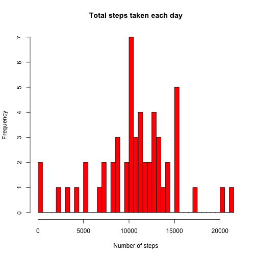
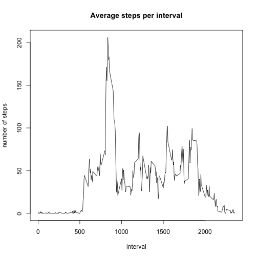
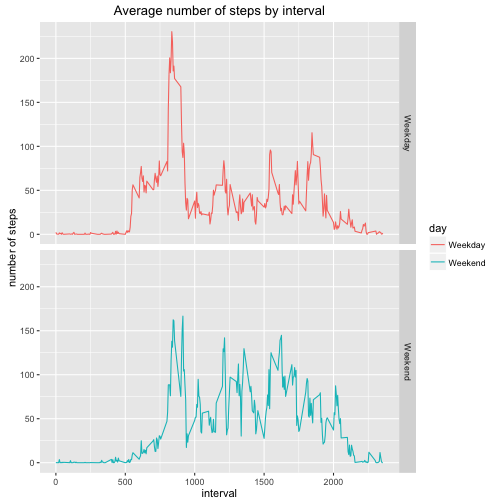

# Title: "Reproducible Research: Peer Assessment 1"
### First knitr document 
=========================


## *Loading and preprocessing the data

1. Load the data
    
    ```r
    data <- read.csv("activity.csv",header=TRUE,
                     colClasses=c("numeric","character","numeric"))
    ```

2. Transform date into a Date format using "as.Date" function
    
    ```r
    data$date <- as.Date(data$date, "%Y-%m-%d")
    ```

## *What is mean total number of steps taken per day? 

(Missing values will be ignored in this part of assignment.) 

3. Calculate the total number of steps taken per day
    
    ```r
    total_per_day <- aggregate(steps ~ date, data, sum)
    ```

4. Make a histogram of total number of steps taken each day
    
    ```r
    with(total_per_day, hist(steps, col = "red", 
                             main = "Total steps taken each day", breaks = 53, 
                             xlab = "Number of steps"))
    ```
    
    

5. Calculate and report the mean and median of the total number of steps taken per day
(I understand this question be calculated based on the result of above step, meaning to calculate mean and median based on sum of steps each day.) 
    
    ```r
    mean_total <- mean(total_per_day$steps)
    median_total <- median(total_per_day$steps)
    ```
The mean value of total number of steps taken per day is 1.0766189 &times; 10<sup>4</sup>, the median value of total number of steps taken per day is 1.0765 &times; 10<sup>4</sup>.


## *What is the average daily activity pattern?

6. Make a time series plot of the 5-min interval(x-axis) and average number of steps taken
    
    ```r
    mean_per_interval <- aggregate(steps ~ interval, data, mean)
    with(mean_per_interval, plot(interval, steps, type = "l", xlab = "interval", 
                                 ylab = "number of steps", 
                                 main = "Average steps per interval"))
    ```
    
    

7. Which 5-min interval contains the maximum number of steps?
    
    ```r
    mean_per_interval$interval[which.max(mean_per_interval$steps)]
    ```
    
    ```
    ## [1] 835
    ```

## *Imputing missing values

8. Calculate and report the total number of missing values in the dataset
    
    ```r
    a <- sum(is.na(data$date))
    b <- sum(is.na(data$steps))
    c <- sum(is.na(data$interval))
    ```
Total missing values in the dataset is 0 of column "date"", 2304 of column "steps" and 0 of column "interval".

9. Devise a strategy for filling in all of the missing values in the dataset
It is obvious that number of steps taken vary quite a lot among different time intervals of a day, therefore the author recommends to use mean for 5-minute interval as a replacement of missing values of steps. 

10. Create a new dataset that is equal to the original dataset but with the missing data filled in
    
    ```r
    datanew <- data
    for(i in unique(datanew$interval))
        datanew[which(is.na(datanew$steps) & datanew$interval == i), "steps"] <- mean(datanew[datanew$interval == i, "steps"], na.rm = TRUE)
    ```

11. Make a histogram of the total number of steps taken each day and Calculate and report the mean and median total number of steps taken per day. Do these values differ from the estimates from the first part of the assignment? What is the impact of imputing missing data on the estimates of the total daily number of steps?
    
    ```r
    total_per_day2 <- aggregate(steps ~ date, datanew, sum)
    with(total_per_day2, hist(steps, col = "red", main = "Total steps taken each day(without NA)", breaks = 61, xlab = "Number of steps"))
    ```
    
    
    
    ```r
    mean_total2 <- mean(total_per_day2$steps)
    median_total2 <- median(total_per_day2$steps)
    ```
The mean value of total number of steps taken per day is 1.0766189 &times; 10<sup>4</sup>, the median value of total number of steps taken per day is 1.0766189 &times; 10<sup>4</sup>.

We found that imputing missing data makes no difference to the mean of total steps taken per day, but slightly increaes the median value. 

## *Are there differences in activity patterns between weekdays and weekends?

12. Create a new factor variable in the dataset with two levels – “weekday” and “weekend” indicating whether a given date is a weekday or weekend day.
    
    ```r
    datanew$weekday <- weekdays(datanew$date)
    datanew$day <- factor(ifelse(datanew$weekday %in% c("Saturday","Sunday"),
                                 "Weekend","Weekday"))
    ```

13. Make a panel plot containing a time series plot (i.e. type = "l") of the 5-minute interval (x-axis) and the average number of steps taken, averaged across all weekday days or weekend days (y-axis). 
    
    
    ```r
    mean_per_interval2 <- aggregate(steps ~ interval + day, datanew, mean)
    library(ggplot2)
    g <- ggplot(mean_per_interval2, aes(interval, steps))
    g + geom_line(aes(color = day)) + facet_grid(day ~ .) + labs(x = "interval", y = "number of steps", title = "Average number of steps by interval")
    ```
    
    

